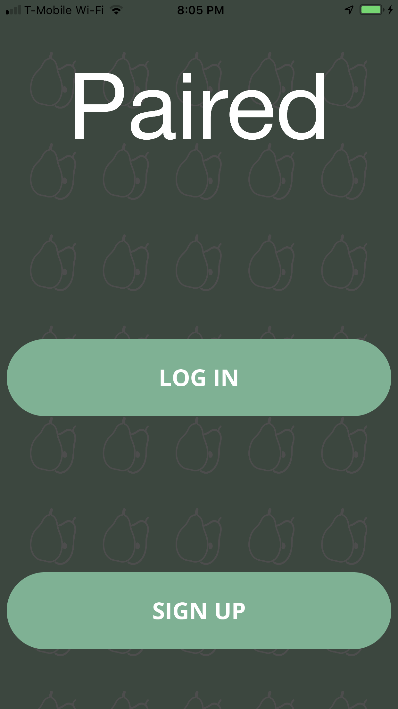
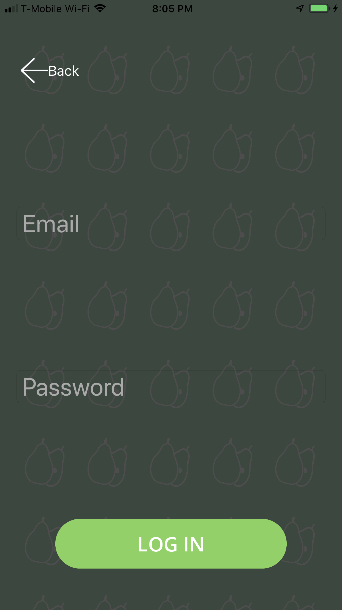
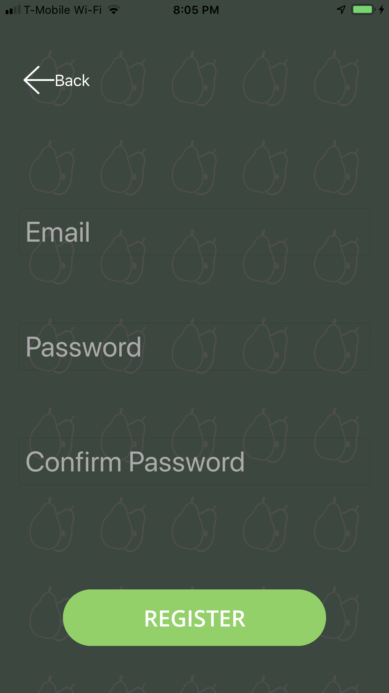
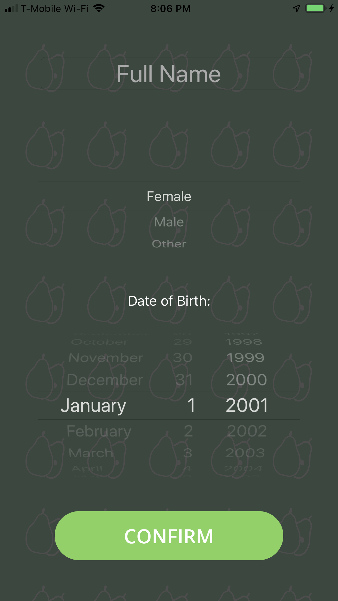
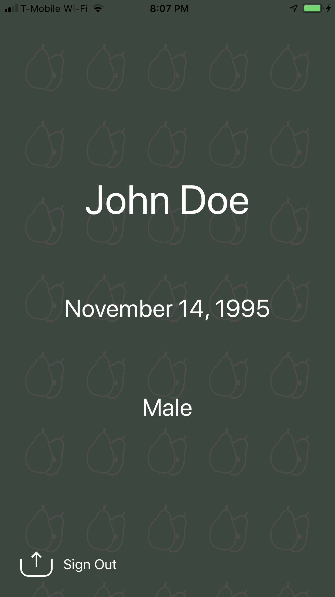

# Paired Dating

The iOS application Paired Dating allows users to create a very simple profile that includes their name, birthdate, and gender. Once a new user enters their email address, they are sent a verification email through Firebase. The user cannot sign in until they click on the verification link sent to them. 

Once logged in, if the user has not yet set up a profile, the app will take them to a screen where they can enter their name, birthdate, and gender. Upon completion, the user is taken back to their profile screen, which will display their info (which is also stored in Firebase). 

The app's background image and logo are inspired by the Paired logo displayed on AngelList. In accordance with the logo, the color scheme is predominantly comprised of pastel green and white. 

<b>To run the application, download the zip file and open the file PairedDating.xcworkspace. Trying to run PairedDating.xcodeproj will result in an error.</b>

I spent ten hours getting this application ready. Given more time, here are some more updates I would pursue:
Allowing the user to add a photo to their profile
Allowing the user to add a gender preference (i.e. stating whether they are looking for males, females, etc.)
Adding a "Forgot Password?" option
Smoother navigation between screens
Moving text field to show if it is being blocked by the keyboard

<i>Here are some screenshots of the application: </i>
 
<kbd></kbd> <kbd></kbd><kbd></kbd>
<kbd></kbd> <kbd></kbd>
